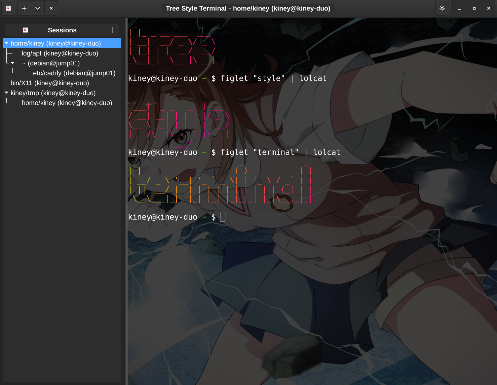

# Tree Style Terminal

A Python/GTK3 terminal application featuring a collapsible tree-based session navigator instead of traditional tabs.
It is roughly inspired by tree-style-tabs add-on for Firefox.


*Tree Style Terminal in action with dark theme, showing hierarchical session organization and transparent background*

## Overview

Tree Style Terminal reimagines terminal session management by organizing sessions in an infinitely nestable tree structure displayed in a hideable sidebar. Instead of managing dozens of tabs, you can create hierarchical relationships between terminal sessions, making it easier to organize complex workflows and development environments.

## Key Features

- **Tree-based Session Management**: Organize terminal sessions in a hierarchical tree structure
- **Collapsible Sidebar**: Toggle the session navigator to maximize terminal space
- **Session Adoption**: When a parent session closes, child sessions are automatically adopted by the grandparent
- **Smart Font Scaling**: Automatic DPI detection and scaling for high-resolution displays
- **Modern GTK3 Interface**: Native Wayland and X11 support with CSS theming
- **VTE Terminal Engine**: Same high-performance terminal engine used by GNOME Terminal
- **Light/Dark Themes**: Toggle between light and dark themes with CSS theming system
- **Flexible Configuration**: Comprehensive YAML configuration file for customizing themes, UI settings, and display scaling

## Current Status

This project is in active development. Currently implemented:

- ✅ Core application structure with GTK3 interface
- ✅ Session management system (`TerminalSession`, `SessionTree`, `SessionManager`)
- ✅ Tree-based sidebar with navigation (`SessionSidebar`)
- ✅ VTE terminal integration with spawn functionality
- ✅ Automatic font scaling and DPI detection for high-resolution displays
- ✅ Complete theming system with light/dark CSS themes
- ✅ Command-line interface with DPI override options
- ✅ YAML configuration system with validation and automatic template creation
- ✅ Comprehensive test suite with unit and integration tests
- ✅ Smart terminal naming based on working directory
- ⏳ Session persistence and tree state management (in progress)
- ⏳ Full keyboard navigation support (in progress)
- ⏳ Packaging and distribution (in progress)
- ⏳ Better Quality Assurance (in progress)

## Installation

### System Dependencies (Required)

**Important**: GTK, VTE, and PyGObject must be installed via system package manager, not pip.

**Ubuntu/Debian:**

sudo apt install python3-dev libgirepository1.0-dev libcairo2-dev pkg-config python3-gi python3-gi-cairo gir1.2-gtk-3.0 gir1.2-vte-2.91

### Python Package

After installing system dependencies:

```bash
git clone <repository-url>
cd tree-style-terminal
pip install -e ".[dev]"
```

**Note**: The pyproject.toml intentionally does not include GTK/VTE dependencies as they must be installed system-wide.

## Configuration

Tree Style Terminal supports extensive customization through a YAML configuration file located at `~/.config/tree-style-terminal/config.yaml`. The configuration file is automatically created with default values on first run.
Also see [CONFIG.md](CONFIG.md)

### Key Configuration Options

- **Theme**: Choose between light, dark, or automatic (follows system theme)
- **Display Scaling**: Configure DPI scaling for high-resolution displays
- **Terminal Settings**: Customize scrollback buffer size
- **UI Settings**: Adjust sidebar width and other interface elements

**Example configuration:**
```yaml
theme: "dark"
display:
  dpi_scale: 2.0  # 200% scaling for 4K displays
ui:
  sidebar_width: 300
terminal:
  scrollback_lines: 20000
```

For complete configuration documentation, see [CONFIG.md](CONFIG.md).

## Usage

### Basic Application Launch

```bash
# Standard launch with automatic font scaling
tree-style-terminal
# or shorthand
tst
```

### Font and Display Configuration

Tree Style Terminal automatically detects your system's DPI and font settings to provide optimal scaling on high-resolution displays.

#### Automatic Font Scaling

The application automatically:
- Detects your system's DPI settings
- Uses your system's default font preferences
- Scales fonts appropriately for high-DPI displays
- Ensures minimum readable font sizes on 4K+ displays

#### Manual DPI Override

If fonts appear too small or large, you can override the DPI detection:

```bash
# Using command-line arguments (recommended)
python -m tree_style_terminal --dpi 144    # 1.5x scaling for 1440p displays
python -m tree_style_terminal --dpi 192    # 2x scaling for 4K displays
python -m tree_style_terminal --dpi 240    # 2.5x scaling for high-DPI 4K

# Using environment variables
TST_DPI=192 python -m tree_style_terminal
```

#### Testing Font Scaling

Check your system's font scaling and test different DPI values:

```bash
# Show system font information with the GUI
python -m tree_style_terminal --show-info

# Test font scaling without starting the GUI
python -m tree_style_terminal --test-fonts
python -m tree_style_terminal --test-fonts --dpi 192
```

#### Complete Command-Line Reference

```bash
python -m tree_style_terminal --help              # Show all options and examples
python -m tree_style_terminal                     # Launch with automatic scaling
python -m tree_style_terminal --dpi 192           # Set DPI for font scaling
python -m tree_style_terminal --show-info         # Display system font information
python -m tree_style_terminal --test-fonts        # Show font scaling test and exit
python -m tree_style_terminal --quiet             # Suppress startup messages

# Combined options
python -m tree_style_terminal --dpi 180 --quiet   # Launch with custom DPI, no messages
python -m tree_style_terminal --show-info --dpi 240  # Test DPI without starting GUI

# Environment variable alternative
TST_DPI=192 python -m tree_style_terminal          # Set DPI via environment
```

## Theming

Tree Style Terminal supports light and dark themes through GTK CSS:

- **Default**: Light theme
- **Toggle**: Click the theme button (🌙/☀️ icon) in the header bar
- **Custom CSS**: Place custom styles in `~/.config/tree-style-terminal/custom.css` (planned)

### CSS Variables

The application uses CSS custom properties for consistent theming:

- `--bg-primary`, `--bg-secondary`: Background colors
- `--fg-primary`, `--fg-secondary`: Foreground colors
- `--accent-color`: Highlight color
- `--terminal-bg`, `--terminal-fg`: Terminal colors
- `--sidebar-bg`, `--sidebar-selected`: Sidebar colors

### Theme Files

CSS themes are located in `src/tree_style_terminal/resources/css/`:
- `style.css`: Base styles and CSS variables
- `light-theme.css`: Light theme color overrides
- `dark-theme.css`: Dark theme color overrides

## Session Management (Planned)

The following features are planned for the session management system:

### Keyboard Navigation
- **New Child Session**: `Ctrl+Shift+N` - Create a new session as a child of the current session
- **New Sibling Session**: `Ctrl+Alt+N` - Create a new session at the same level as the current session
- **Close Session**: `Ctrl+Shift+W` - Close the current session (children are adopted by parent)
- **Toggle Sidebar**: `Ctrl+Shift+E` - Show/hide the session tree sidebar
- **Navigate Sessions**: Click on sessions in the sidebar or use `Ctrl+PageUp`/`Ctrl+PageDown`

### Session Tree Navigation
The sidebar displays terminal sessions in a tree structure:
- **Root Sessions**: Top-level sessions with no parent
- **Child Sessions**: Sessions created from within other sessions
- **Session Adoption**: When you close a session with children, those children become children of the closed session's parent

### Smart Terminal Naming (Planned)
Terminal sessions will be automatically named based on your current working directory and shell context:
- **Directory-based Names**: Session names show the last two path components (e.g., `projects/myapp`)
- **User Context**: Session names include user@host information when available
- **Real-time Updates**: Session names automatically update when you change directories
- **Intelligent Parsing**: Handles various shell prompt formats with graceful fallbacks

## Development

### Setup Development Environment

1. Clone the repository and set up the environment:
```bash
git clone <repository-url>
cd tree-style-terminal
python -m venv .venv
source .venv/bin/activate  # On Windows: .venv\Scripts\activate
```

2. Install system dependencies (see Installation section above), then install in development mode:
```bash
pip install -e ".[dev]"
```

3. Install pre-commit hooks:
```bash
pre-commit install
```

### Running Tests

```bash
pytest
```

The project includes comprehensive unit and integration tests covering:
- Session management and tree operations
- UI component integration
- Theme and CSS functionality
- Font scaling and DPI detection

### Code Quality

The project uses several tools to maintain code quality:

- **ruff**: Fast Python linter and code formatter
- **black**: Code formatting
- **isort**: Import sorting
- **mypy**: Static type checking

Run all checks:
```bash
ruff check .
black --check .
isort --check-only .
mypy src/
```

## Architecture

Tree Style Terminal follows a clean architecture with clear separation of concerns:

- **Models**: Core domain objects (`TerminalSession`, `SessionTree`)
- **Controllers**: Business logic and event handling (`SessionManager`, `SidebarController`)
- **Widgets**: GTK3 UI components and terminal integration (`SessionSidebar`, `VteTerminal`)
- **Resources**: CSS themes and configuration files

The application uses the Model-View-Controller pattern with GTK3 widgets as views, dedicated controller classes for business logic, and clean model classes for data representation.

## Requirements

- Python 3.11+
- GTK 3.0+
- VTE 2.91+
- PyGObject
- PyCairo
- PyYAML

## Author & Contact

**Author:** Jannik Winkel
**Copyright:** cubigato GmbH
**Contact:** See imprint on [cubigato.de](https://cubigato.de/impressum/)

## License

This project is licensed under the GNU General Public License v3.0 - see the [LICENSE](LICENSE) file for details.
